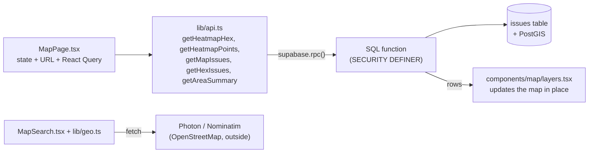

# Map guide

How the AmarShohor map works, from what users see down to the SQL, as of migration 0035 (October 2026). Read this before changing anything under `web/src/components/map/`, `web/src/pages/MapPage.tsx`, `web/src/lib/mapMath.ts` or the map functions in `supabase/migrations/`.

## 1. What the map does

The map at `/map` shows where real, unfixed problems are and how serious each area is.

| Feature | What the user sees |
|---|---|
| **Hexagons** (default) | A grid of hexagons, light to dark red. Darker = more heat. Size follows the zoom (20 km sides zoomed out, 80 m close up). |
| **Heat** | A smooth blur, blue (low) to red (high). Quick to read, less exact. |
| **Pins** | One pin per issue, merged into numbered bubbles when zoomed out. Checkboxes: validated, needs validation, resolved. |
| **Filters** | Main category group, and time: **All time / Last 30 days / Last 7 days**. Shows "N issues in view". |
| **Search** | Places (OpenStreetMap), reported issues and pasted coordinates (`23.81, 90.41`). Up to 200 characters, so a pasted page of text isn't sent to the search services. |
| **Click a hexagon** | "Around Sector 7, Uttara", its count, heat and main group, and its 20 most serious issues with the exact total. "Show them as pins" zooms in. |
| **Dropped pin** | Right-click / long-press, a search result or the location button. A panel describes the circle around it (500 m to 5 km): level (No active issues → Severe), counts, what makes it hot, hottest issues. |
| **Share** | The link button copies the current view; whoever opens it sees the same map. |
| **Other** | Zoom + / − buttons (desktop; phones pinch), legend, "How is the heat calculated?", a message when the view is empty, a "2000+" note when Pins hits its limit, dark map tiles in dark mode. Filters start folded on phones. On desktop the hexagon and pin panels open below the location and share buttons. |

Two smaller maps reuse the same pieces: **LocationPicker** in the report form (where is the problem?) and **AreaDrawer** in Admin (draw a City Corporation's area).

## 2. How a request travels

Every map request follows one path. Learn it once and you can follow any feature.



1. Panning or zooming fires Leaflet's `moveend` (it also fires after every zoom, so it is the only event needed). `ViewportWatcher` reads the visible box, adds 15% around it, rounds it to 3 decimals and keeps it inside ±180 / ±90 (`clampBBox`), because PostGIS refuses coordinates past the edge of the world. The map can't be zoomed out past level 5 (about the size of the region), so it never shows the whole world.
2. The box, mode, hexagon size, category, time and pin types form the **React Query key**. A new key loads data; a key seen before is answered from the cache. The old result stays on screen while the new one loads.
3. `lib/api.ts` calls one SQL function through Supabase RPC.
4. The function applies the rules (section 3) and returns rows.
5. A layer in `layers.tsx` changes only what is different: pins and hexagons that stay are left alone, new hexagons fade in, the heat layer swaps its points.

The browser never reads the `issues` table directly. The map functions run as `SECURITY DEFINER`, return only safe columns and skip hidden issues, so a modified frontend can't see private data or fake the heat.

## 3. The rules

**Which issues count.** Hexagons, heat, the hexagon list and the area summary use only validated, unfixed issues: statuses `validated`, `escalated`, `under_review`, `assigned`, `in_progress`, `resolution_submitted`. Pins can also show unverified (`community_review`) and resolved (`closed`) ones.

**Heat of one issue** (SQL `issue_heat_weight`):

```
heat = severity × (1 + ln(1 + confirmations) + 0.25 × ln(1 + upvotes)) × freshness
```

- Severity: low 1, medium 2, high 3, critical 4.
- `ln` grows slowly, so the 50th upvote adds far less than the 1st (vote spam doesn't pay).
- Freshness halves every `heat_half_life_days` (30) since validation, never below `heat_min_decay` (35%). Both are in `app_settings`.
- Example: high, 2 confirmations, 4 upvotes, validated today → 3 × (1 + 1.10 + 0.40) = **7.5**.

**Hexagons.** Each issue goes into exactly one hexagon (`hex_of`); its colour is the sum of its issues' heat. The grid is fixed: its size is corrected for map stretch at one latitude, the middle of the service area (about 23.6°), so hexagons never move while you pan (0029). Colour bands are 10 / 25 / 50 / 75% of the hottest hexagon in view. Edge hexagons are counted completely, including issues just off screen (0023).

**Heat mode.** The API returns at most 1,000 rows, so nearby issues are merged into one weighted point per grid cell, with `issue_count` so "N issues in view" counts issues, not points (0014, 0027).

**Time filter** (0034). "Last 7 / 30 days" keeps issues **reported** in that time. All five map functions use the same rule (`reported_within`), so a hexagon's number, its list and the pin's summary always agree. With no time filter the app doesn't send the input at all.

**Area levels** (heat per km² in the pin's circle): Low ≤ 1.5, Moderate ≤ 5, High ≤ 12, then Severe. "No active issues" when nothing is active.

## 4. The link (URL)

The whole view lives in the URL, so it can be shared, bookmarked and survives a reload. Defaults are left out to keep links short.

| Parameter | Meaning | Default |
|---|---|---|
| `mode` | `heat` or `pins` | hexagons |
| `category` | main category group (old links with a single category still work) | all |
| `days` | `7` or `30` | all time |
| `pins` | pin types, e.g. `active,resolved`; empty = none ticked | `active` |
| `lat`, `lng` | dropped pin; empty or impossible values are ignored | no pin |
| `r` | pin circle in metres: 500, 2000, 5000 | 1000 |
| `place`, `issue` | pin name, and the issue it came from | none |

Example: `/map?mode=pins&days=7&pins=active,resolved&lat=23.87&lng=90.39&r=2000`

## 5. Files

| File | What it holds |
|---|---|
| `web/src/pages/MapPage.tsx` | The page: URL, viewport, data query, buttons, Filters, legends, help, empty message |
| `web/src/components/map/layers.tsx` | What's drawn: `ClusterLayer` (pins), `HeatLayer`, `HexLayer`, `SearchPinLayer`, `DropPinOnHold` |
| `web/src/components/map/HexPanel.tsx` | The clicked hexagon: area name + issue list |
| `web/src/components/map/AreaPanel.tsx` | The dropped pin's summary |
| `web/src/components/map/MapSearch.tsx` | Search box: places, issues, coordinates, keyboard, screen readers |
| `web/src/components/map/LocationPicker.tsx`, `AreaDrawer.tsx` | The report form map, the Admin area map |
| `web/src/lib/mapMath.ts` | All the map's calculations, free of React and Leaflet so they are unit tested |
| `web/src/lib/geo.ts` | GPS, distances, place search (Photon, Nominatim), addresses and area names |
| `web/src/lib/api.ts` | `getMapIssues`, `getHeatmapHex`, `getHeatmapPoints`, `getHexIssues`, `getAreaSummary` |
| `web/src/lib/leaflet.ts` | Pin icons (made once per colour and kind) and the tile address |

## 6. Database

| SQL function | Returns | Newest version |
|---|---|---|
| `heatmap_hex` | hexagons: shape, heat, issue count, top group | 0034 |
| `heatmap_points` | merged heat points with issue counts | 0034 |
| `map_issues` | up to 2,000 pins | 0034 |
| `hex_issues` | the most serious issues in one hexagon + exact total | 0034 |
| `area_heat_summary` | the pin's circle: counts, heat, groups, hottest | 0034 |
| `issue_heat_weight` | one issue's heat | 0003 |
| `hex_size_3857`, `hex_of` | the fixed hexagon grid (internal) | 0029 |
| `reported_within` | the time rule (internal) | 0034 |

When a function is changed, the **newest migration that defines it** is the one that runs. Changing a function's inputs means dropping the old version, creating the new one and granting it again (see 0034).

Map history: 0003 first map functions · 0006 area summary · 0013 category groups · 0014 heat under the row limit · 0015 top group per hexagon · 0023 complete edge hexagons · 0027 heat point counts · 0029 fixed grid · 0030 hexagon list from the server · 0034 time filter.

## 7. Tests

```bash
cd web
npm test          # everything, no database needed
npx vitest        # re-run on save
```

| Test file | Covers |
|---|---|
| `lib/mapMath.test.ts` | hexagon sizes and colours, radius, pin links, view clamp, URL filters, counts, levels, area drawing |
| `lib/geo.test.ts`, `lib/geo.search.test.ts` | distances, coordinates, address clean-up, Bangla search, search per area, area names (fake internet) |
| `lib/api.map.test.ts` | the time filter is sent only when set |
| `lib/leaflet.test.ts` | pin icons are reused |
| `components/map/*.test.tsx` | search box, area panel, hexagon panel, pin layer (simulated browser) |
| `pages/MapPage.test.tsx` | time filter, share button, pin links, zoom buttons |

Database checks for the map are in `supabase/tests/scenario_v3.sql` (run with `run_local.sh` on a local Postgres with PostGIS).

## 8. Where to change common things

| Change | Where |
|---|---|
| Hexagon colours | `HEX_COLORS` in `mapMath.ts` (legend and panels follow) |
| Hexagon size per zoom | `hexSizeForZoom` in `mapMath.ts` (update its test) |
| Pin circle sizes | `RADII` in `mapMath.ts` |
| Time choices | `TIME_RANGES` in `mapMath.ts` (the database accepts 1 to 3650 days) |
| Area level names / limits | `HEAT_LEVELS` in `mapMath.ts` |
| How fast heat fades | `update app_settings set heat_half_life_days = 14 where id = 1;` (no code) |
| Severity weights | `severity_weight` in a new migration |
| A new filter for every map view | new migration (input on all five functions) → `api.ts` → `MapPage.tsx` URL + query key + panels |

Always run `npm test` after a change, and update the test that describes the old behaviour.

## 9. Known limits

- Hexagon colours are relative to the view, so a hexagon can change colour when you pan to a hotter or calmer area; its heat score doesn't.
- Pins stop at 2,000 per view (the map says so).
- Place names and search come from free outside services (Photon, Nominatim); if they are down, search shows an error and panels say "This area".
- A hexagon is named after its middle point, which can sit just inside the next neighbourhood.
- Every pan beyond the rounding loads again, even inside the area already loaded.

## 10. Questions to be ready for

- **Why hexagons?** Equal size and equal distance to every neighbour, so areas compare fairly, and each issue is counted once.
- **Why aren't unverified or fixed issues on the heatmap?** It should show real, current problems.
- **What happens when I pan?** `moveend` → new box → new React Query key → `api.ts` → SQL function → layer updates in place.
- **Why SQL functions instead of reading tables?** One place for the rules, safe columns only, nothing the browser can change.
- **Why `ln` in the heat formula?** So many upvotes can't outweigh a few on-site confirmations.
- **Why is the grid fixed (0029)?** Correcting the stretch for the screen's own latitude moved the whole grid on every pan.
- **Why merge heat points?** The API returns at most 1,000 rows.
- **How do the hexagon number and its list always match?** Both use `hex_of` and the same status, category and time rules.
- **How is the map shared?** Everything is in the URL; the button copies it.
- **How was it tested?** Vitest unit tests for the calculations, React Testing Library for the panels and page with fake data, SQL scenario checks for the functions.
